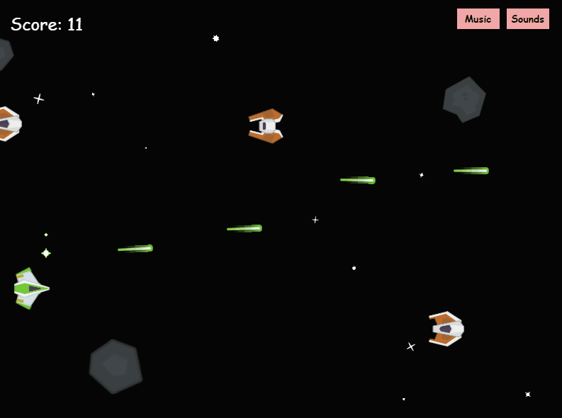

<!--### [Hello there!](https://www.youtube.com/watch?v=eaEMSKzqGAg)-->

# Heyooo!
Im DAM, a frontend game developer!

|  Playn'go test [ Github](https://github.com/DAM001/PlaynGO) |  Conquer   Github (private repo) |
| --- | --- |
|  Project-7  Github (private repo) | |
| --- | --- |